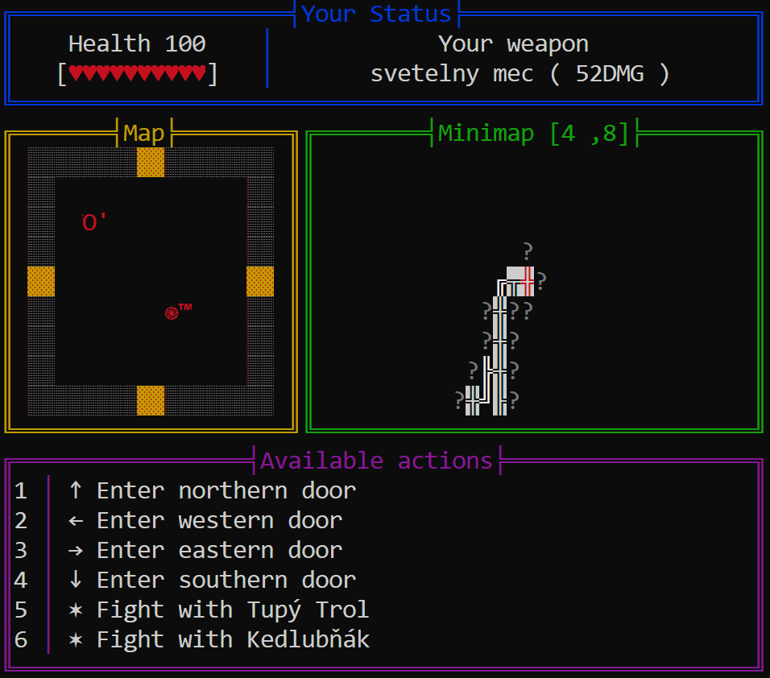
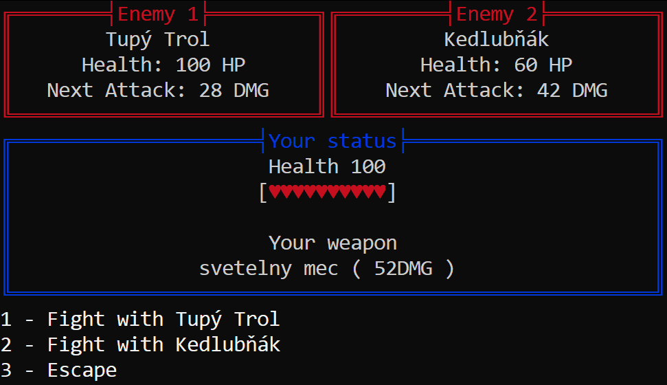

#Dungeon crawler
Originally a university project. We were given the task to make a console-based dungeon crawler in a team of ~4 people.

---

Bugy:

|    Status    | Description |
|:------------:|:------------|
|     Open     | After loading a game all rooms in the minimap use the "●" symbol. |
